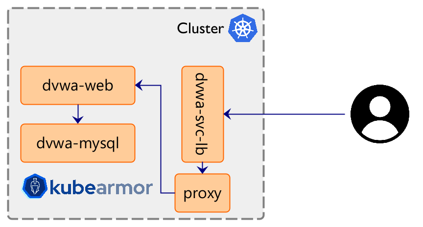

# DVWA

DVWA installation [here](https://github.com/cytopia/docker-dvwa#kubernetes).

### allow.yaml

KubeArmor policy to allow specific operations for dvwa web app i.e., allow apache2, ping, dash.

### deny-shadow.yaml

Deny access to /etc/shadow for all processes.

### dvwa-upload.php

PHP code for remote command injection.

## DVWA Runtime Security Best Practices
1. Create new namespace for installing dvwa: `kubectl create ns dvwa`
1. Install DVWA application: `kubectl apply -f https://raw.githubusercontent.com/nyrahul/src/master/dvwa/dvwa-deploy.yaml -n dvwa`
1. Install karmor cli tool: `curl -sfL http://get.kubearmor.io/ | sudo sh -s -- -b /usr/local/bin`

## Application Hardening
1. Get recommended policies for dvwa app: `karmor recommend -n dvwa`
1. Get behavioural policies for dvwa app: `karmor discover -n dvwa`
1. Get network segmentation policies for dvwa app: `karmor discover -n dvwa -p NetworkPolicy`
